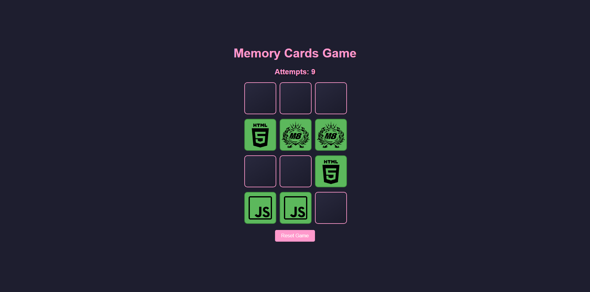

<h1 align="center"> 🃏 Memory Cards 🃏 </h1>

### 🌐 Demo / Preview


---

### ✏️ **Description**
**Memory Cards** is a classic memory game developed in React, designed as a learning exercise to master the essential tools and concepts of React. The goal is to match pairs of cards by clicking and memorizing their positions.  

The project focuses on building a functional game logic, managing state effectively, and ensuring reactivity and interactivity. Additionally, the design is entirely personal, showcasing creative freedom alongside technical implementation.

### 💻 **Technologies Used**
- **React**: For building the interactive game interface and managing state.
- **JSX**: For structuring the components and ensuring clean, readable code.
- **CSS**: For custom styling to enhance the visual appeal.

### **Key Learning Objectives** 🎯
🧠 **State Management**: Using React's `useState` and `useEffect` hooks to handle game logic and reactivity.

🔄 **Dynamic Rendering**: Generating card elements dynamically and updating the DOM efficiently.

🎨 **Custom Design**: Applying personal styling for an engaging user experience.

⚙️ **Component-based Architecture**: Structuring the application into reusable and modular components.

### **Game Features** 🚀
🃏 **Interactive gameplay**: Players match pairs of cards by clicking and memorizing their positions.

🔄 **Shuffle mechanic**: Cards shuffle at the start of the game and after every round.

📈 **Progress tracking**: Reactively updates the game state to provide immediate feedback.

🎨 **Custom styling**: Unique and personalized design for a visually appealing experience.

### 🛠️ **Installation & Usage**
1. Clone the repository:
   ```bash
   git clone https://github.com/HUYBERIC/MemoryCards.git
   cd MemoryCards
   ```

2. Install dependencies:
   ```bash
   npm install
   ```

3. Start the development server:
   ```bash
   npm start
   ```

4. Open `http://localhost:3000` in your browser to play the game.

<br>
<br>
<br>

---

<h1 align="center"> 🃏 Memory Cards 🃏 </h1>

---

### ✏️ **Description**
**Memory Cards** est un jeu classique de mémoire développé en React, conçu comme un exercice d'apprentissage pour maîtriser les outils et concepts essentiels de React. L'objectif est d'associer des paires de cartes en cliquant et en mémorisant leurs positions.  

Le projet met l'accent sur la construction d'une logique de jeu fonctionnelle, la gestion efficace de l'état, ainsi que sur la réactivité et l'interactivité. Le design est entièrement personnel, alliant créativité et implémentation technique.

### 💻 **Technologies utilisées**
- **React** : Pour construire l'interface interactive et gérer l'état.
- **JSX** : Pour structurer les composants et garantir un code propre et lisible.
- **CSS** : Pour un style personnalisé améliorant l'attrait visuel.

### **Objectifs d'apprentissage clés** 🎯
🧠 **Gestion de l'état** : Utilisation des hooks React (`useState`, `useEffect`) pour gérer la logique du jeu et la réactivité.

🔄 **Rendu dynamique** : Génération dynamique des cartes et mise à jour efficace du DOM.

🎨 **Design personnalisé** : Application de styles personnels pour une expérience utilisateur attrayante.

⚙️ **Architecture basée sur les composants** : Structuration de l'application en composants modulaires et réutilisables.

### **Caractéristiques du jeu** 🚀
🃏 **Gameplay interactif** : Les joueurs associent des paires de cartes en cliquant et mémorisant leurs positions.

🔄 **Mécanisme de mélange** : Les cartes se mélangent au début du jeu et après chaque manche.

📈 **Suivi de progression** : Mise à jour réactive de l'état du jeu pour fournir un retour immédiat.

🎨 **Style personnalisé** : Design unique et personnel pour une expérience visuellement attrayante.

### 🛠️ **Installation & Utilisation**
1. Cloner le dépôt :
   ```bash
   git clone https://github.com/HUYBERIC/MemoryCards.git
   cd MemoryCards
   ```

2. Installer les dépendances :
   ```bash
   npm install
   ```

3. Lancer le serveur de développement :
   ```bash
   npm start
   ```

4. Ouvrir `http://localhost:3000` dans votre navigateur pour jouer au jeu.
